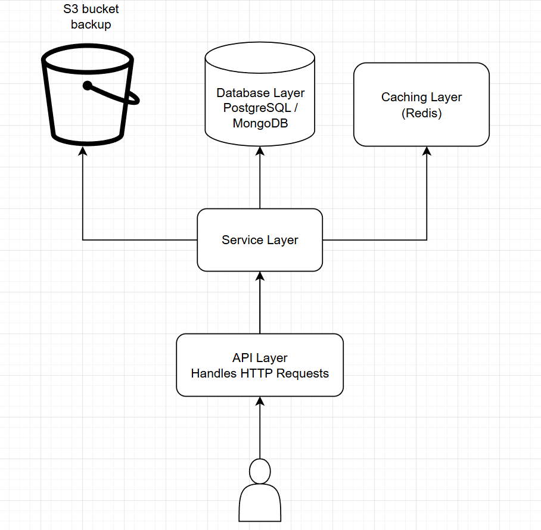

# 🏛 2. Architecture

The architecture follows a **layered microservice approach** to ensure clear separation of concerns, scalability, and maintainability.

---

## 📝 High-Level Architecture

### **Components**

#### **1. API Layer**

- **Responsibilities**:
  - Accept HTTP requests (`GET`/`POST`).
  - Perform input validation using libraries like **Joi** or **Zod**.
  - Return proper HTTP responses (e.g., `200`, `400`, `500`).
- **Framework**:  
  Built with **Node.js** and **Fastify**.
- **Scalability**:  
  Load balanced using **Kubernetes Services**.

---

#### **2. Service Layer**

- **Responsibilities**:
  - Encapsulate business logic.
  - Call the **Database Layer** for data persistence and retrieval.
- **Design**:  
  Keep service functions **stateless** to facilitate horizontal scaling.

---

#### **3. Database Layer**

- **Database Choice**:
  - **PostgreSQL**: Strong ACID compliance, ideal for structured data and relational queries.
  - **MongoDB**: Flexible, optimized for semi-structured or unstructured JSON data.
- **Justification**:
  - **PostgreSQL**: Excellent for relational queries and supports indexing for scalability.
  - **MongoDB**: Enables fast document-based querying and flexibility at scale.
  - Database choice depends on specific data requirements.
- **Scalability**:
  - Use **read replicas** or **sharding** to horizontally scale database performance.

---

#### **4. Caching Layer (Optional)**

- Use **Redis** to:
  - Cache frequently accessed `GET` requests.
  - Reduce database load and improve response times for read-heavy operations.

---

## 🖼️ Architectural Diagram

## 

## 💡 Rationale for Architecture

1. **Layered Design**:  
   Ensures a clear separation of concerns between the API, business logic, and database layers.
2. **Stateless Services**:  
   Stateless design allows the service to easily scale horizontally, enabling load balancing across multiple instances.

3. **Database Technology**:

   - **PostgreSQL**: Ensures consistency and structure for relational data.
   - **MongoDB**: Provides flexibility for semi-structured and unstructured data.

4. **Caching**:  
   Using **Redis** reduces the need to query the database repeatedly for frequent `GET` requests, improving overall performance.

---
