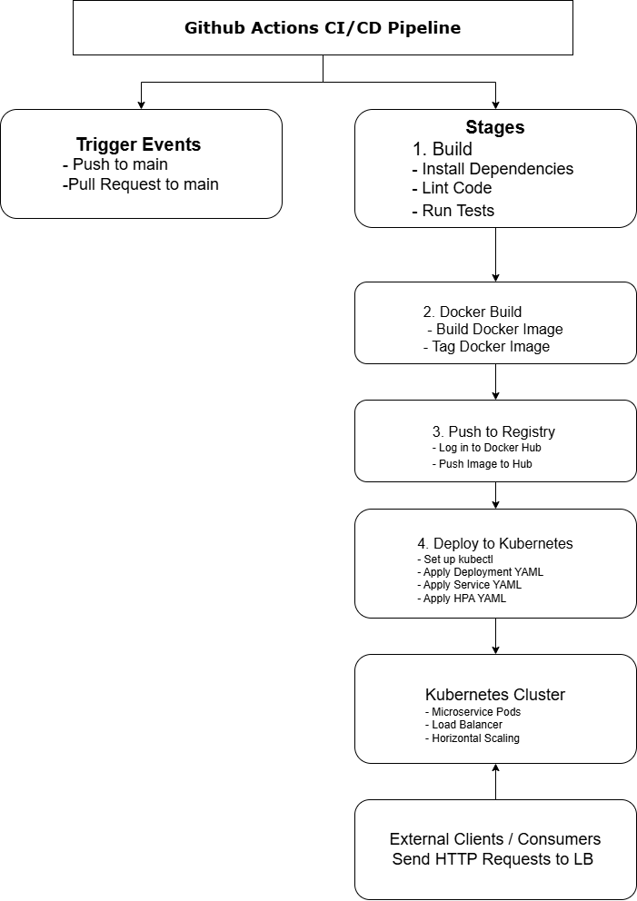

# 🔧 CI/CD Pipeline

The **CI/CD pipeline** is implemented using **GitHub Actions** to automate the processes of build, test, containerization, and deployment. Below, we detail the triggers, stages, and the YAML file for configuration.

---

## 📝 GitHub Actions Pipeline

### **Trigger**

The pipeline is triggered on:

- **Push** to the `main` branch.
- **Pull Requests** targeting the `main` branch.

---

### **Stages**

1. **Build**:

   - Installs project dependencies.
   - Runs code quality checks with linting.
   - Executes automated tests.

2. **Docker Build**:

   - Builds a Docker image for the microservice.

3. **Push to Registry**:

   - Pushes the Docker image to Docker Hub or another container registry.

4. **Deploy to Kubernetes**:
   - Applies the Kubernetes manifest files to the cluster to deploy the microservice.

---

## 📄 GitHub Actions YAML File

The YAML file to configure the pipeline in **GitHub Actions** is shown below:

```yaml
name: CI/CD Pipeline

on:
  push:
    branches:
      - main
  pull_request:
    branches:
      - main

jobs:
  build:
    name: Build and Test
    runs-on: ubuntu-latest

    steps:
      # Step 1: Checkout code
      - name: Checkout code
        uses: actions/checkout@v3

      # Step 2: Set up Node.js
      - name: Set up Node.js
        uses: actions/setup-node@v3
        with:
          node-version: 20

      # Step 3: Install dependencies
      - name: Install dependencies
        run: npm install

      # Step 4: Run linting
      - name: Run linting
        run: npm run lint

      # Step 5: Run tests
      - name: Run tests
        run: npm test

  docker:
    name: Build and Push Docker Image
    runs-on: ubuntu-latest
    needs: build

    steps:
      # Step 1: Checkout code
      - name: Checkout code
        uses: actions/checkout@v3

      # Step 2: Log in to Docker Hub
      - name: Log in to Docker Hub
        uses: docker/login-action@v2
        with:
          username: ${{ secrets.DOCKER_USERNAME }}
          password: ${{ secrets.DOCKER_PASSWORD }}

      # Step 3: Build Docker image
      - name: Build Docker image
        run: |
          docker build -t your-dockerhub-repo/microservice:latest .

      # Step 4: Push Docker image to Docker Hub
      - name: Push Docker image
        run: |
          docker push your-dockerhub-repo/microservice:latest

  deploy:
    name: Deploy to Kubernetes
    runs-on: ubuntu-latest
    needs: docker

    steps:
      # Step 1: Checkout code
      - name: Checkout code
        uses: actions/checkout@v3

      # Step 2: Set up kubectl
      - name: Set up kubectl
        uses: azure/setup-kubectl@v3
        with:
          version: "latest"

      # Step 3: Authenticate with Kubernetes cluster
      - name: Authenticate with Kubernetes
        run: |
          echo "${{ secrets.KUBECONFIG }}" > kubeconfig
          export KUBECONFIG=kubeconfig

      # Step 4: Apply Kubernetes manifests
      - name: Apply Kubernetes manifests
        run: |
          kubectl apply -f k8s/deployment.yaml
          kubectl apply -f k8s/service.yaml
          kubectl apply -f k8s/hpa.yaml
```

## 
