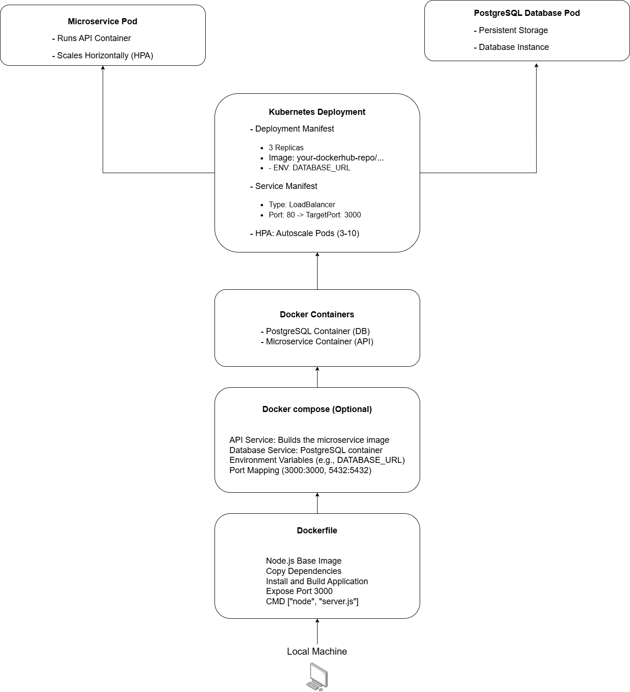

# 🐳 3. Containerization

To ensure the microservice is easily portable and deployable, we utilize **Docker** for containerization. This includes creating a `Dockerfile` to containerize the application and an optional `docker-compose.yml` file for managing multiple services (e.g., API and database).

---

## 📄 Dockerfile

Below is a simplified version of the `Dockerfile` used to containerize the microservice:

```dockerfile
# Base image
FROM node:20

# Set working directory
WORKDIR /app

# Copy dependencies
COPY package.json package-lock.json ./

# Install dependencies
RUN npm install

# Copy application source
COPY . .

# Expose API port
EXPOSE 3000

# Command to run the app
CMD ["node", "server.js"]
```

# ☸️ 4. Kubernetes Deployment

To deploy and manage the microservice in a Kubernetes environment, we utilize **Kubernetes manifests** for the deployment, service, and horizontal pod autoscaling (HPA). These configurations enable scalability, availability, and efficient resource utilization.

---

## 📄 Kubernetes Manifest Files

### **Deployment YAML**

The following `Deployment` manifest creates three replicas of the microservice API and sets environment variables for connecting to a PostgreSQL database.

````yaml
apiVersion: apps/v1
kind: Deployment
metadata:
  name: microservice-api
spec:
  replicas: 3
  selector:
    matchLabels:
      app: microservice
  template:
    metadata:
      labels:
        app: microservice
    spec:
      containers:
      - name: api
        image: your-dockerhub-repo/microservice:latest
        ports:
        - containerPort: 3000
        env:
        - name: DATABASE_URL
          value: "postgres://user:pass@db:5432/db_name"

## 📄 Service YAML

The `Service` manifest exposes the microservice via a **LoadBalancer**. This allows external clients to communicate with the application through a single public IP address.

```yaml
apiVersion: v1
kind: Service
metadata:
  name: microservice-service
spec:
  selector:
    app: microservice
  ports:
    - protocol: TCP
      port: 80
      targetPort: 3000
  type: LoadBalancer
````

## 
